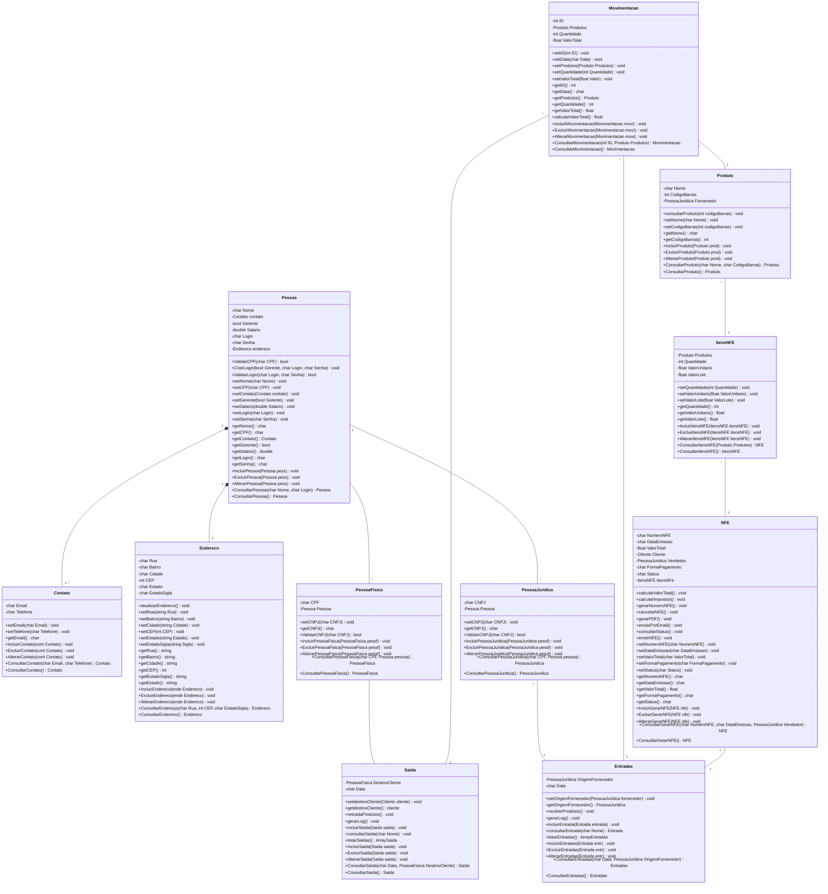
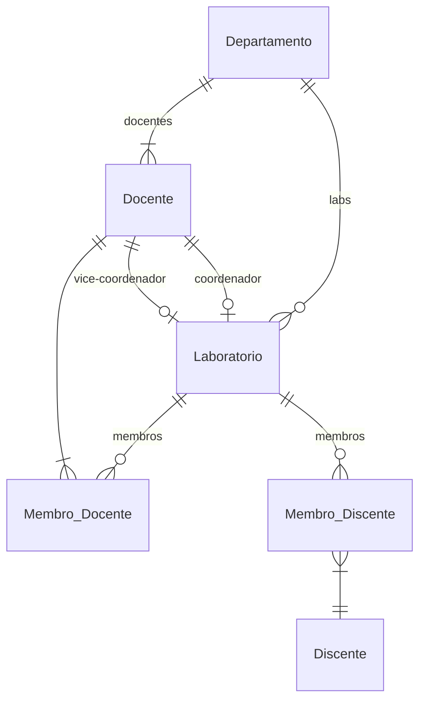

# Documento de Modelos

Neste documento temos o modelo Conceitual (UML) ou de Dados (Entidade-Relacionamento). Temos também a descrição das entidades e o dicionário de dados.

## Modelo Conceitual

### Diagrama de Classes usando Mermaid

### Descrição das Entidades

Descrição sucinta das entidades presentes no sistema.

| Entidade | Descrição   |
|----------|------------------------------------------------------------------------------------------------------------------------------------------------------|
| Pessoa   | Entidade que representa uma Pessoa tem as informações: Nome, Contato, Gerente, Salário, Login, Senha, Endereço,+ValidarCPF(char CPF), +CriarLogin(bool Gerente, char Login, char Senha), +ValidarLogin(char Login, char Senha), +setNome(char Nome), +setCPF(char CPF), +setContato(Contato contato), +setGerente(bool Gerente), +setSalario(double Salario), +setLogin(char Login), +setSenha(char Senha), +getNome(), +getCPF(), +getContato(), +getGerente(), +getSalario(), +getLogin(), +getSenha(), +IncluirPessoa(Pessoa pess), +ExcluirPessoa(Pessoa pess), +AlterarPessoa(Pessoa pess), +ConsultarPessoa(char Nome, char Login), +ConsultarPessoa()|
| Endereco | Entidade que representa um Endereço tem as informações: +atualizarEndereco(), +setRua(string Rua), +setBairro(string Bairro), +setCidade(string Cidade), +setCEP(int CEP), +setEstado(string Estado), +setEstadoSigla(string Sigla), +getRua(), +getBairro(), +getCidade(), +getCEP(), +getEstadoSigla(), +getEstado(), +IncluirEndereco(ende Endereco), +ExcluirEndereco(ende Endereco), +AlterarEndereco(ende Endereco), +ConsultarEndereço(char Rua, int CEP, char EstadoSigla), +ConsultarEndereco()|
| Contato  | Entidade que representa um Contato tem as informações: Email, Telefone, +setEmail(char Email), +setTelefone(char Telefone), +getEmail(), +IncluirContato(cont Contato), +ExcluirContato(cont Contato),  +AlterarContato(cont Contato),+ConsultarContato(char Email, char Telefone), +ConsultarContato().|
| PessoaFisica | Entidade que representa uma Pessoa Fisica tem as informações: CPF, Pessoa, +setCNPJ(char CNPJ), +getCNPJ(), +ValidarCNPJ(char CNPJ), +IncluirPessoaFisica(PessoaFisica pessf), +ExcluirPessoaFisica(PessoaFisica pessf), +AlterarPessoaFisica(PessoaFisica pessf), +ConsultarPessoaFisica(char CPF, Pessoa pessoa), +ConsultarPessoaFisica().|
| PessoaJuridica | Entidade que representa uma Pessoa Juridica tem as informações: CNPJ, Pessoa, +setCNPJ(char CNPJ), +getCNPJ(), +ValidarCNPJ(char CNPJ), +IncluirPessoaJuridica(PessoaJuridica pessf), +ExcluirPessoaJuridica(PessoaJuridica pessf), +AlterarPessoaJuridica(PessoaJuridica pessf), +ConsultarPessoaJuridica(char CPF, Pessoa pessoa), +ConsultarPessoaJuridica().|
| Produto | Entidade que representa um Produto tem as informações: Nome, CodigoBarras, Fornecedor, +consultarProduto(int codigoBarras), +setNome(char Nome), +setCodigoBarras(int codigoBarras), +getNome(), +getCodigoBarras() int, +IncluirProduto(Produto prod) , +ExcluirProduto(Produto prod), +AlterarProduto(Produto prod), +ConsultarProduto(char Nome, char CodigoBarras), +ConsultarProduto()|
| Movimentacao | Entidade que representa uma Movimentacao tem as informações: ID, Produtos, Quantidade, ValorTotal, +setID(int ID), +setData(char Data), +setProdutos(Produto Produtos), +setQuantidade(int Quantidade), +setValorTotal(float Valor), +getID(), +getData(), +getProdutos(), +getQuantidade(), +getValorTotal(), +calcularValorTotal(), +IncluirMovimentacao(Movimentacao movi), +ExcluirMovimentacao(Movimentacao movi), +AlterarMovimentacao(Movimentacao movi), +ConsultarMovimentacao(int ID, Produto Produtos) , +ConsultarMovimentacao().|
| ItensNFE| Entidade que representa ItensNFE tem as informações: Produtos, Quantidade, ValorUnitario, ValorLote, +setQuantidade(int Quantidade), +setValorUnitario(float ValorUnitario), +setValorLote(float ValorLote), +getQuantidade(), +getValorUnitario(), +getValorLote(), +IncluirItensNFE(ItensNFE itensNFE), +ExcluirItensNFE(ItensNFE itensNFE), +AlterarItensNFE(ItensNFE itensNFE), +ConsultarItensNFE(Produto Produtos), +ConsultarItensNFE().|
| NFE | Entidade que representa uma NFE tem as informações: NumeroNFE, DataEmissao, ValorTotal, cliente, Vendedor, FormaPagamento, Status, ItensNFe, +calcularValorTotal(), +calcularImpostos(), +gerarNumeroNFE(), +cancelarNFE(), +gerarPDF(), +enviarPorEmail(), +consultarStatus(), +emitirNFE(), +setNumeroNFE(char NumeroNFE), +setDataEmissao(char DataEmissao), +setValorTotal(char ValorTotal), +setFormaPagamento(char FormaPagamento), +setStatus(char Status), +getNumeroNFE() , +getDataEmissao() , +getValorTotal(), +getFormaPagamento() , +getStatus() , +IncluirGerarNFE(NFE nfe), +ExcluirGerarNFE(NFE nfe), +AlterarGerarNFE(NFE nfe), +ConsultarGerarNFE(char NumeroNFE, char DataEmissao, PessoaJuridica Vendedor), +ConsultarGerarNFE().|
| Saida| Entidade que representa uma Saida tem as informações: DestinoCliente, Data, +setdestinoCliente(Cliente cliente), +getdestinoCliente() , +retiradaProdutos(), +gerarLog(), +incluirSaida(Saida saida), +consultarSaida(char Nome), +listarSaidas() , +IncluirSaida(Saida saida), +ExcluirSaida(Saida saida), +AlterarSaida(Saida saida), +ConsultarSaida(char Data, PessoaFisica DestinoCliente), +ConsultarSaida().|
| Entradas| Entidade que representa uma Entrada tem as informações: OrigemFornecedor, Data, +setOrigemFornecedor(PessoaJuridica fornecedor), +getOrigemFornecedor() , +receberProdutos(), +gerarLog(), +incluirEntrada(Entrada entrada), +consultarEntrada(char Nome) , +listarEntradas() , +IncluirEntradas(Entrada entr), +ExcluirEntradas(Entrada entr), +AlterarEntradas(Entrada entr), +ConsultarEntradas(char Data, PessoaJuridica OrigemFornecedor), +ConsultarEntradas(). |

## Modelo de Dados (Entidade-Relacionamento)

Para criar modelos ER é possível usar o BrModelo e gerar uma imagem. Contudo, atualmente é possível criar modelos ER usando a ferramenta **Mermaid**, escrevendo o modelo diretamente em markdown. Acesse a documentação para escrever modelos [ER Diagram Mermaid](https://mermaid-js.github.io/mermaid/#/entityRelationshipDiagram).

### Dicionário de Dados

|   Tabela   | Laboratório |
| ---------- | ----------- |
| Descrição  | Armazena as informações de um laboratório acadêmico. |
| Observação | Laboratórios acadêmicos podem ser de Ensino, Pesquisa, Extensão, P&D, etc. |

|  Nome         | Descrição                        | Tipo de Dado | Tamanho | Restrições de Domínio |
| ------------- | -------------------------------- | ------------ | ------- | --------------------- |
| codigo        | identificador gerado pelo SGBD   | SERIAL       | ---     | PK / Identity |
| sigla         | representação em sigla do lab    | VARCHAR      | 15      | Unique / Not Null |
| nome          | nome do laboratório              | VARCHAR      | 150     | Not Null |
| descricao     | detalhes sobre o laboratório     | VARCHAR      | 250     | --- |
| endereco      | endereço e localização do lab    | VARCHAR      | 150     | --- |
| data_criacao  | data de criação do lab           | DATE         | ---     | Not Null |
| portaria      | portaria de criação do lab       | VARCHAR      | 50      | --- |
| link_portaria | URL para a portaria (PDF)        | VARCHAR      | 150     | --- |
| site          | URL para o site do laboratório   | VARCHAR      | 150     | --- |
| e-mail        | e-mail de contato do laboratório | VARCHAR      | 150     | --- |
| departamento  | departamento vinculado ao lab    | SERIAL       | ---     | FK / Not Null |
